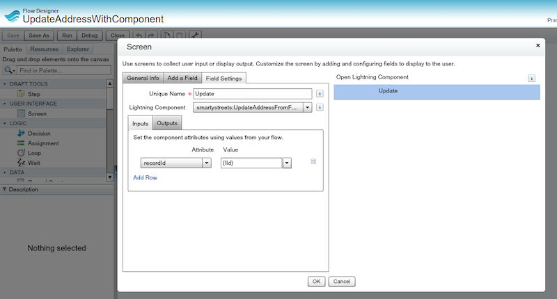

# INSTRUCTIONS

In order to use this flow, you will need to set up a few Lightning components and an event.

1. Make sure you are on version 4.12 or later.  If not, email support@toafinish.com with your org id and ask for an update.
2. Create the naviagteFlow Lightning event using the file in this folder
3. Create the FlowFooter Lightning Component using the files in this folder
4. Create the UpdateAddressFromFlow Lightning Component using the files in this folder
5. Build a new Flow - or edit an existing one
   1. Drag a "Screen" element from the palette
   2. Give it a name like "Open Verification Component"
   3. Click on the "Add A Field" tab, choose the "Lightning Component" element at the bottom, uncheck the "Show Footer" and "Show Header" options.
   4. Click on it, if it isn't visible, and give it a name like "Update"
   5. From the Lightning Component list, select "c:UpdateAddressFromFlow"
   6. In the "Input" subtab, select the "recordId" Attribute, and enter {!Id} in the Value element
   7. Press the OK button
   8. If this is a new flow and this is the only element in the flow, then hover over the element, and press the "Set as Start Element" green arrow in the top-right of the Screen element.
   9. Save the flow and give it a name like "Verify"
   10. Activate the Flow if it is a new flow

6. If it is a new flow, create a new URL button on the object you want to run it from, with a URL something like this (depending on what name you gave it): /flow/Verify?Id={!Account.Id}&retURL={!Account.Id}
7. Add this button to the layout for your Lightning page layout

You are now ready to test it out!
