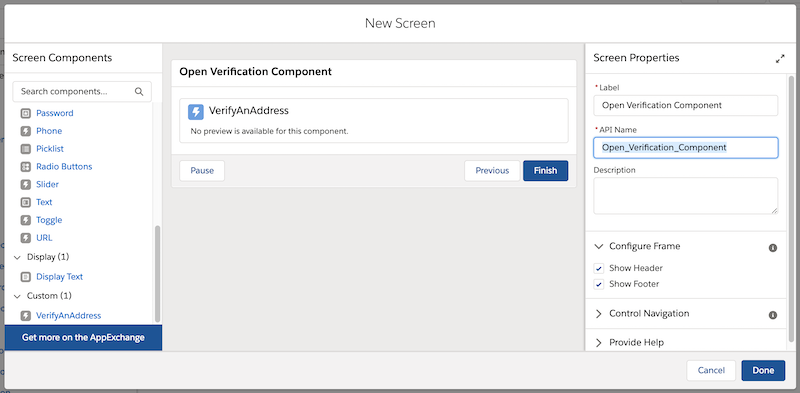
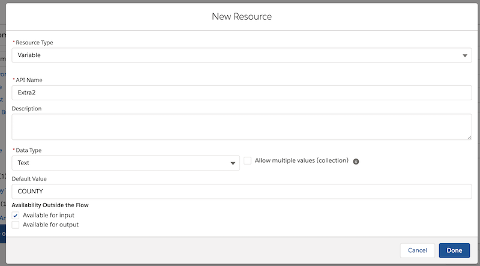
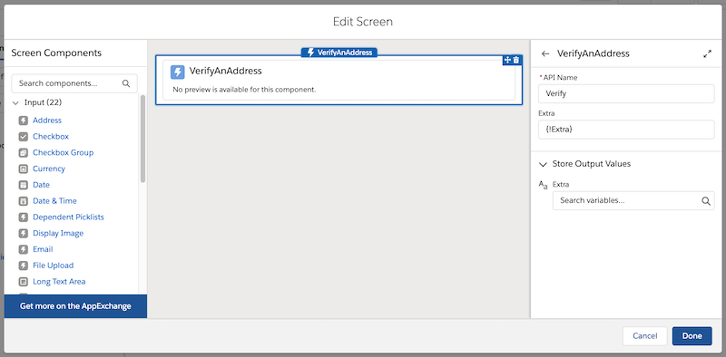
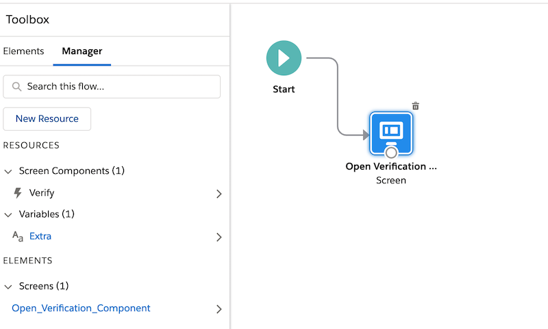

# INSTRUCTIONS FOR VERIFICATION FLOWS
## INCLUDING SAVING AND NON-SAVING VERSIONS

In order to use this flow, you will need to set up one ore more Lightning components.

1. Make sure you are on version 5.0 or later. If not, email support@toafinish.com with your org id and ask for an update.
2. Create the appropriate Lightning components:
	1. If you want to set up a flow that verifies existing records, create the <b>naviagteFlow</b>, <b>FlowFooter</b>, and <b>UpdateAddressFromFlow</b> Lightning Components using the files in the "Saving" folder
	2. If you want to set up a flow that verifies an address without saving records, create the VerifyAnAddress Lightning Component using the files in the "No_Saving" folder
3. Build a new Flow - or edit an existing one
	1. Drag a "Screen" element from the palette
        2. Give it a label name like "Open Verification Component"
	3. From the list of items on the left, scroll down and select the appropriate "VerifyAnAddress" lightning component you created in the 2nd step.  You should now see this new lighting component added inside the original screen element, like this:
		*  Select UpdateAddressFromFlow for the "saving" flow
		*  Select VerifyAnAddress for the "no saving" flow
   
	4. Click on the new lightning component and give it a name like "Verify" or "Update".
		1. For the "saving" flow, in the "recordId" input field, delete whatever value is there, and choose the "New Resource" option, and then select "Variable".  In the variable popup, give it a name like "Id", Data Type should be "Text", check "Available for Input" and "Available for Output" and the Default Value should be blank.
		1. For the "no saving" flow, in the "Extra" input field, delete whatever value is there, and choose the "New Resource" option, and then select "Variable".  In the variable popup, give it a name like "Extra", Data Type should be "Text", check "Available for Input" (but not output) then the Default Value can be: YES, COUNTY, or COUNTYFIPS.  If you put "YES" it will bring both County and County FIPs into the results. 
	5. Press "Done" to save:
   
	7. Click back on the header, and then uncheck the "Show Footer" and "Show Header" options from General Info.
   
	8. Press the Done button
	9. Connect the Screen element that you just created to the previous step in the flow.  If this is a new flow, then you want to connect it to the Start icon.  To do so, hover over the circle at the bottom of the Start icon and drag it to the Screen element and release it.  That should connect it:
   
	10. Save the flow and give it a name like "Address Verification Plugin"
	11. Activate the Flow if it is a new flow
4.  To run the flow:
	1. For the saving version, create a new URL button on the object you want to run it from, with a URL something like this (depending on what name you gave it): /flow/Verify?Id={!Account.Id}&retURL={!Account.Id}
	2. You can Run the non-saving flow using the "Run" button on the flow, or to run it later, you can use a URL such as this one: "/flow/smartystreets/Address_Verification_Plugin", you will find the Url when you will save a flow.

> NOTE: To run from Lighting, make sure you have the "Enable Lightning runtime for flows" in the "Process Automation Settings" in Setup.

You are now ready to test it out!
